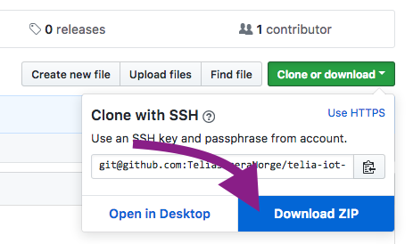
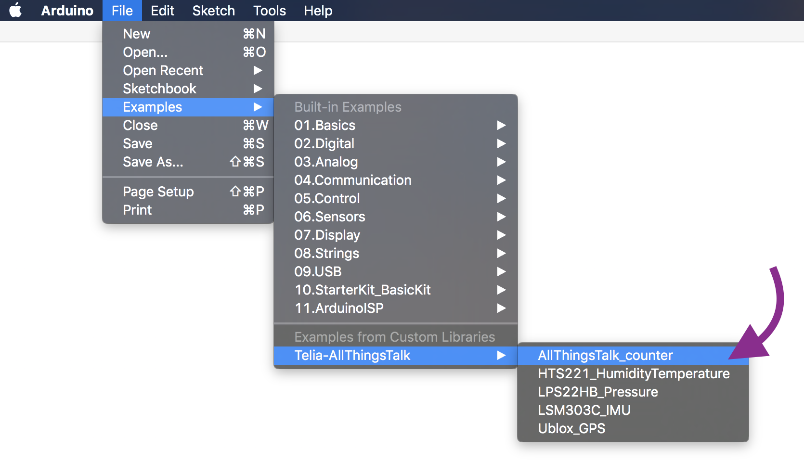
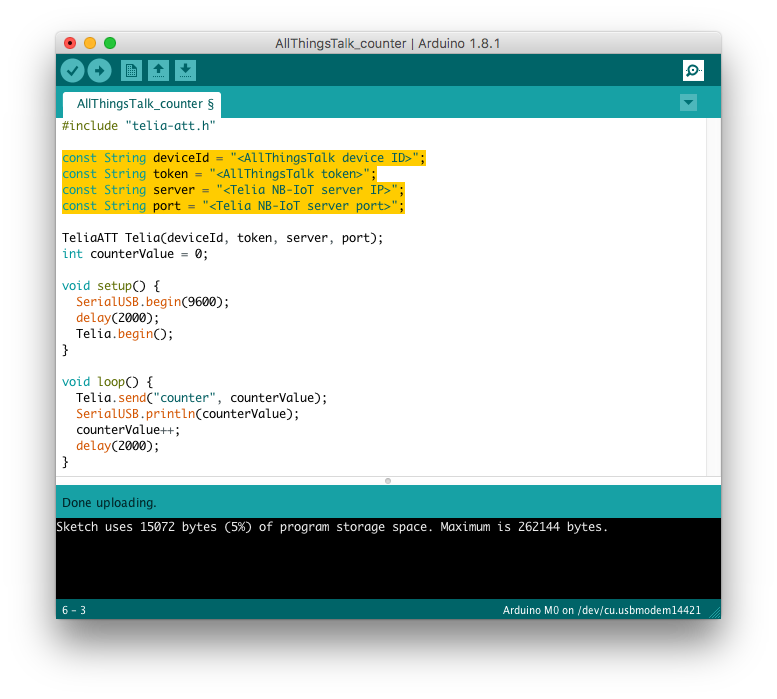

# Telia IoT Workshop
Welcome to the Telia IoT Workshop! Today we will try out some cutting-edge IoT technology, namely the brand new [NB-IoT](https://www.u-blox.com/en/narrowband-iot-nb-iot) network and the [Sodaq NB-IoT Arduino shield](https://shop.sodaq.com/en/nb-iot-shield-deluxe-dual-band-8-20.html).

Learn more about IoT in Telia at https://telia.no/iot and https://telia.io.


## 1. Install software


The Crowduino M0 is a circuit board with a microcontroller and is compatible with the Arduino echosystem. To program it, we need some software. 

* Follow this guide to set up your computer: https://www.elecrow.com/wiki/index.php?title=Step1:_Download_Arduino_IDE_and_install_Arduino_driver
* After installing the Arduino software, open it and go to "Tools", "Board", "Boards Manager". Search for "Arduino M0" and install the *Arduino SAMD Boards* package.

	


## 2. Blink an led
Make sure everything is working by running a simple example. Follow this guide: https://www.elecrow.com/wiki/index.php?title=Step2:_The_very_basic_experiments_with_Crowduino
(**Note:** select "Arduino M0" in step 3)

You should see the LED on the board blinking.

**Bonus:** try changing the delays and adding in more lines to create other blinking patterns.


## 3. Print a message
It is sometimes helpful to print out a message to yourself to figure out how the code works. Try out this program and see if you can understand it. Create a new file in the Arduino software and paste the code below, then press upload (arrow button). After uploading, open the serial monitor (button on the top right).

```c
int messageNumber = 0;

void setup() {
  SerialUSB.begin(9600);
  SerialUSB.println("Starting program");
}

void loop() {
  SerialUSB.println("This is message number " + String(messageNumber));
  messageNumber++;
  delay(1000);
}
```


**Bonus:** try adding another line with ```Serial.print("Hi! ");``` and upload again. See the difference between ```print``` and ```println```?

## 4. Get connected
The hardware is working, let's make it talk to the Internet! The Telia NB-IoT service has been configured to forward all messages to "your" server. For today, we will use an existing IoT platform to play with the data, but it could of course also be sent directly to your own app or website.

* Go to https://maker.allthingstalk.com and sign up for an account.
* Log in and create a new "ground", you can call it anything you like.
* In your new ground, press "Connect a device" and select "WIFI/LAN devices", then "your own". **Note:** the option "SODAQ NB-IoT shield" in the first tab only works with T-Mobile in the Netherlands and can not be used.


* Each device can have many different sensors, or "assets". Add a new asset to your device by clicking "Create asset". Call the asset "counter" (important!) and set the type to "Integer".

	

	You should now end up at you device page with one asset called "counter".

	

	As you can see, your brand new counter has the value "--". Let's fix that!

* Download the code in this repository by clicking "Clone or Download" and then "Download ZIP" at the top of this page.

	

* In Arduino, click "Sketch", "Include library", "Add .ZIP library" and coose the file you just downloaded.
* Open the example by clicking "File", "Examples", "Telia NB-IoT", "AllThingsTalk_counter"
	
* In the code, put in proper values in the four variables at the top.

	
	
	Device ID and token can be found in AllThingsTalk. Go to back to your device page and click "Settings" in the top right corner, then "Authentication".
	
	
	
	The server and port should be:
	
	```c
	const String server = "34.240.60.70";
	const String port = "33333";
	```
* Connect the Sodaq NB-IoT shield to the Crowduino if you have not already. Make sure all the pins align before pressing down.
* Attach the antenna to its connector if it is not mounted.
* Insert the Telia SIM-card if it is not already in place.
* Upload the code to the device, then go to the website to see your data updating!

**Bonus:** Try setting up boolean, number and string assets in AllThingsTalk and see if you can send in other types of data. They all need to have different names, but can be called the same way in the code.

## 5. Read sensors

The Sodaq NB-IoT shield not only has connectivity, it also has several sensors;

* HTS221 temperature and humidity sensor
* LPS22HB air pressure sensor
* LSM303C accelerometer, compass and temperature sensor
* Ublox GPS

There are examples for how to use each of these in the examples menu where we found the counter example earlier. Let´s read the temperature from the HTS221 and send it to AllThingsTalk.

* Open the example code by clicking "File", "Examples", "Telia-AllThingsTalk", "HTS221_example"
* Insert the device id, token and server information like before.
* Create a new asset in your device with the name "temperature" and the type "Number"
	
* Upload the code and check out your new weather station of the future!

**Bonus:** Cerate a pinboard in AllThingsTalk and set up a graph or a gauge for you sensor

## 6. Do your thing
That's it, you are now a certified IoT hardware maker! Go ahead and think of a project you would like to make. You can also add more sensors, lights or switches if you like. Here are some suggestions:

* Weather station - read all the air-related sensors and publish on a dashboard.
* Movement alarm - read the accelerometer values and send a message if it changes. Bonus: also add a PIR motion sensor.
* Compass - read the compass in the IMU and make a graph that plots where the device is headed.

General hints:
* Note that the GPS probably will not work indoors, but you can of course try if you like.
* Try not to write all the code at once, start simple and check that it works along the way.
* If you want to connect more things to the Crowduino, note that most pins are already in use by the NB-IoT shield. Available pins are D1, D2, D8-D12 and A0-A3. See the full schematic here:
	http://support.sodaq.com/wp-content/uploads/2017/02/nb-iot_shield_rev3b_sch-1.pdf
	

## Sources

To make all the needed libraries available with a single install, this repository contains software for the Sodaq NB-IoT shield borrowed from Sodaq's own examples and a copy of the Sparkfun IMU library. Some modifications have been made to make the examples work on the Crowduino. The original repositories can be found here:

https://github.com/janvl1234/Sodaq_NBIoT_examples

https://github.com/sparkfun/SparkFun_LSM303C_6_DOF_IMU_Breakout_Arduino_Library